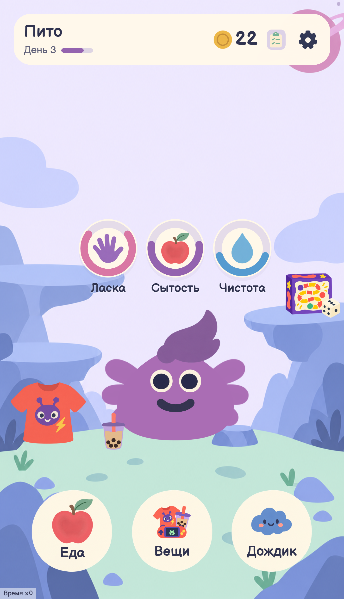
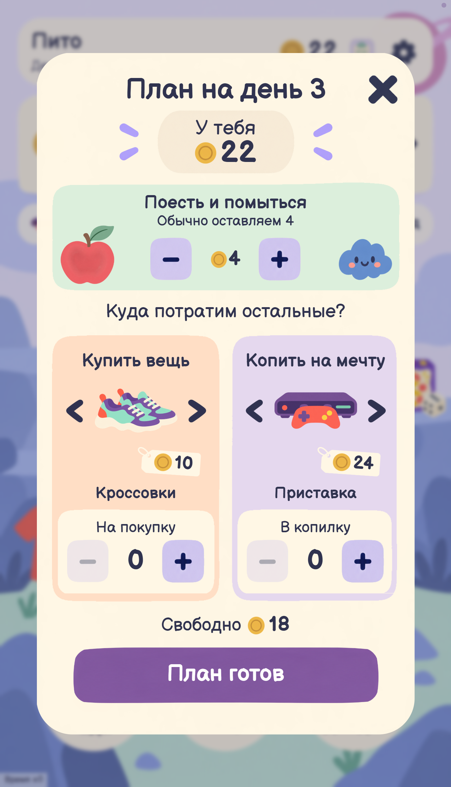
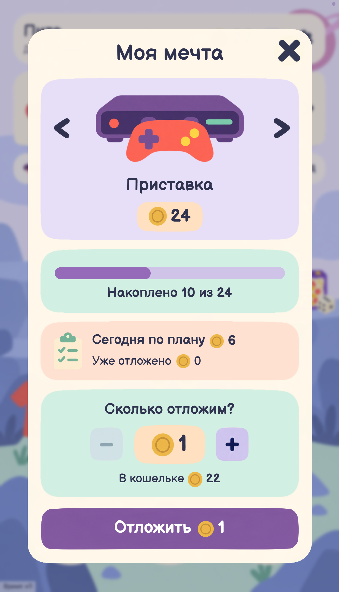

# Пито-Пито

**Твой финансовый дружище.**

Приложение для детей 7–11 лет, построенное вокруг заботы о милом питомце Пито. Игрок кормит и моет его, составляет план расходов, покупает вещи и копит на мечту. Так знакомство с деньгами и разумным потреблением становится частью игры.

Игра работает без Интернета. Без регистрации, рекламы и реальных платежей. Прогресс сохраняется на устройстве.

## Как выглядит игра

<p>
  
  
  
</p>

## Запуск

### Android — основной вариант

[Скачать APK](https://disk.yandex.ru/d/emDP3YPIXSeJRQ) · версия 0.1.4 (5)

Откройте APK на телефоне и разрешите установку из выбранного источника, если Android запросит это. Нужен Android 8.0 или новее с актуальным Android System WebView.

Если Play Защита сообщает, что разработчик ещё не проверен, см. [пояснение по установке](docs/GUIDE.md#установка-apk).

### Веб-версия

Node.js 22+. Из корня репозитория:

```sh
node server.mjs
```

Откройте [localhost:4174](http://127.0.0.1:4174/). Установка npm-зависимостей не нужна. Сохранения браузера и Android независимы.

## Как играть

Создайте Пито и следуйте заданиям: уход → план на день → покупки и накопления → итоги дня → рост питомца. Сохранение плана не тратит деньги: покупать вещи и пополнять копилку нужно самостоятельно.

В настройках можно отключить звук и открыть раздел «Для взрослого». Для быстрого просмотра игры удерживайте правый верхний угол 1,2 секунды: там доступны ускорение ×10 и завершение дня.

## Технологии и структура

HTML, CSS и JavaScript; Android-оболочка на Java и WebView. Общая игровая логика для обеих версий, сохранения в localStorage, звук через Web Audio API. Сервер и аккаунты не требуются.

`src/` — логика и экраны, `styles/` — стили, `assets/` — графика и шрифты, `android/` — Android-оболочка, `docs/` — документация.

## Подробнее

- [Правила игры и помощь](docs/GUIDE.md)
- [Архитектура, данные и структура проекта](docs/ARCHITECTURE.md)
- [Данные и используемые ресурсы](docs/PRIVACY-LICENSES.md)

Разработка: **Oxygen Chick**. Об ошибке можно сообщить в [Issues](https://github.com/oxygenchick/pito/issues).
