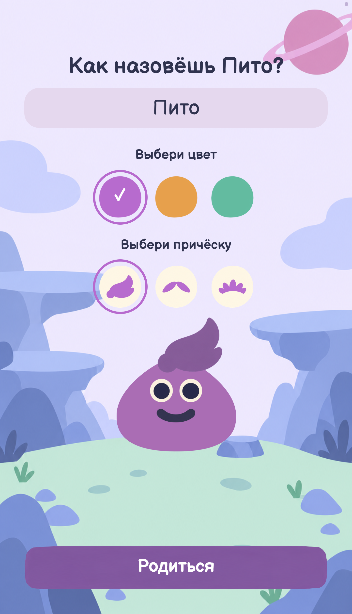

# Как играть в Пито-Пито

[Скачать APK](https://disk.yandex.ru/d/emDP3YPIXSeJRQ) · [На главную](../README.md)

## Установка APK

Нужен Android 8.0 или новее с актуальным Android System WebView. Скачайте и откройте APK. Если Android запросит разрешение, разрешите установку для приложения, которым открыли файл.

**Предупреждение Play Защиты.** Если сообщение говорит, что разработчик ещё не проверен, а файл скачан по ссылке выше и вы доверяете источнику, выберите «Всё равно установить», если этот пункт доступен. Пройдите проверку безопасности, если она предлагается. Отключать защиту целиком не нужно. При сообщении о конкретной угрозе остановите установку и сообщите команде.

Обновление с той же подписью сохраняет профиль. Удаление приложения или его данных удаляет прогресс.

## Первые шаги

1. Выберите имя, цвет и причёску Пито.
2. Получите первые 20 штучек. Нажмите на Пито, чтобы посмотреть его потребности, покормите и помойте его.
3. Составьте план: уход, покупка вещей и накопления на мечту.
4. Следуйте заданиям, покупайте вещи и самостоятельно пополняйте копилку.
5. В конце дня сравните план с результатом и начните новый день.

Карточка под именем Пито подсказывает следующий шаг. Значок блокнота открывает список заданий.

## Деньги и план

«Штучки» — игровая валюта. На старте вы получаете 20, каждый новый день — ещё 8. Некоторые задания дают дополнительные награды.

Сохранение плана не списывает деньги. Он задаёт лимиты на уход и вещи и сумму, которую вы хотите отложить. Свободные деньги остаются в кошельке. План выполнен, если расходы не превысили лимиты, а накопления достигли намеченной суммы.

Яблоко стоит 2 штучки. Дождик расходует 1 штучку за 3 секунды воды, даже если Пито чистый. Отпускайте облачко, когда полив больше не нужен. Обычные вещи стоят 4–16 штучек, мечты — 24–56.

**Копилка.** Выберите мечту и переводите деньги из кошелька. После накопления нужной суммы подтвердите покупку. Купленные вещи остаются в локации.

**Вклад.** С третьего дня, после знакомства с мечтой и копилкой, можно вложить свободные деньги из кошелька. По завершении игрового периода сумму можно забрать с доходом. Сумма возврата показана заранее: вклад 4 штучки возвращает 6. Это условная игровая модель, не реальная банковская ставка.

## Как растёт Пито

В конце дня начисляются шаги роста:

- **Уход +1:** купили еду или воду.
- **План +3:** соблюли план и совершили покупки или накопления. Одного сохранения плана недостаточно.
- **Накопления +1:** отложили штучки в копилку или на вклад.

За день можно получить до 5 шагов. Усики появляются при 4 шагах и двух завершённых днях, ножки — при 10 шагах и пяти завершённых днях. Уже полученный рост сохраняется, даже если следующий план не выполнен.

## Настройки и раздел для взрослого

Настройки открываются значком вверху экрана. Здесь можно отключить музыку и звуки. Раздел «Для взрослого» показывает пройденные темы и позволяет начать заново после подтверждения. Для входа нужно решить пример; это защита от случайного нажатия, не пароль.

## Быстрый просмотр

Обычный игровой день длится 8 минут. Удерживайте правый верхний угол 1,2 секунды: в меню можно включить скорость ×10 или завершить день сразу. Результат всё равно зависит от ваших действий, а не от ускорения.

Прогресс сохраняется автоматически на устройстве. Между Android и браузером он не переносится.

## Чему посвящены задания

| Тема и задания | Что пробует игрок | Объяснение |
|---|---|---|
| Планирование: «План на первый день», «Спланируй следующий день» | Оставляет деньги на нужное, затем сравнивает план и расходы | План — это намерение, а не трата; вчерашние расходы помогают решить, сколько оставить сегодня |
| Покупки: «Пора подкрепиться», «Выбери себе вещь» | Сравнивает цену с кошельком, покупает или откладывает вещь | Важно, чтобы оставалось на нужное |
| Накопления: «Выбери мечту», «Пополни копилку», «Открой первый вклад» | Выбирает цель, откладывает деньги и ждёт возврата вклада | Можно копить понемногу; деньги на вкладе временно недоступны |
| Разумное потребление: «Помой Пито» | Моет питомца и отпускает облако, когда воды достаточно | Дождик расходует штучки, поэтому его не нужно держать постоянно |

[Архитектура](ARCHITECTURE.md) · [Данные и ресурсы](PRIVACY-LICENSES.md)
